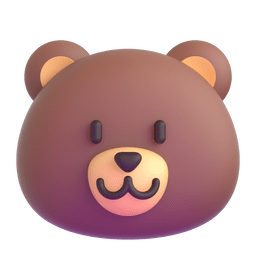

# `SheraBot-MD`


[](https://postimg.cc/D4bVhszs)


<!-- RAINBOW LINE BOT -->


√ proporcionaré ejemplos:

#### `1 El nombre de tu carpeta es:` Sher

#### `2 El nombre de la carpeta de emojis, es:` emojis

#### `3 escribe el nombre correctamente del emoji que quieras, por ejemplo: Bear.png`
<!-- RAINBOW LINE BOT -->


EJEMPLOS:
```js
//Un emoji de corazon en llamas, el nombre tiene
//que ser exacto, por ejemplo:


```
## `Demostracion`

<!-- RAINBOW LINE BOT -->


##  AGRADECIMIENTO 
[](https://wa.me/5493873687620) `Support Bots`

[](https://wa.me/19145948340) `Guardian_Creator`

```bash
termux-setup-storage
```

```bash
apt-get update -y && apt-get upgrade -y
```

```bash
pkg install -y git nodejs ffmpeg imagemagick && pkg install yarn
```

```bash
git clone https://github.com/TaekookGJ/SheraBot-MD && cd SheraBot-MD&& yarn install && npm install
```

```bash
ls
```
```bash
npm update
```

```bash
npm start
```
